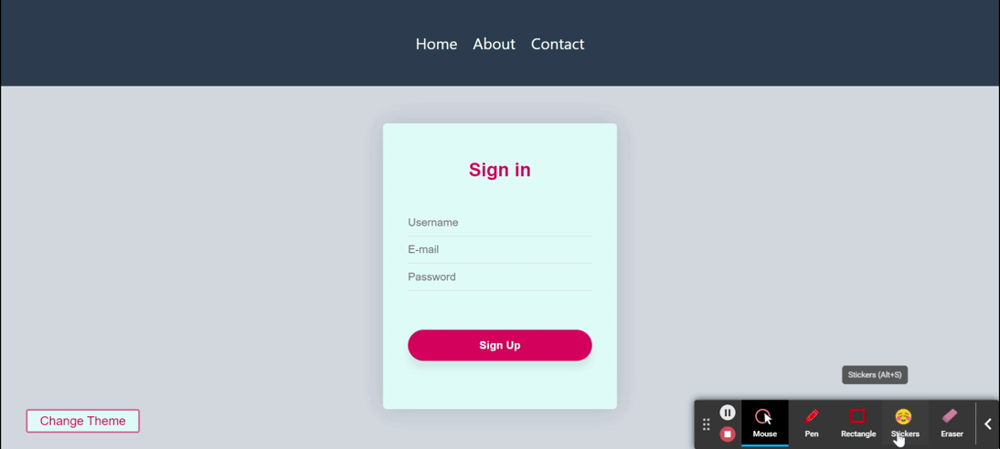

## Styled-Components Exercise

I styled a simple page with styled-components. The home page contains navbar, a card with input section and button. There are also router to about and contacts pages. In addition I created  a change theme button on home page to change themes of navbar, card section and background-color of page. 

## FEATURES :rocket:

* HTML
* JavaScript
* Styled-Components
* ThemeProvider
* React
* React-Router-Dom
* Context-API

